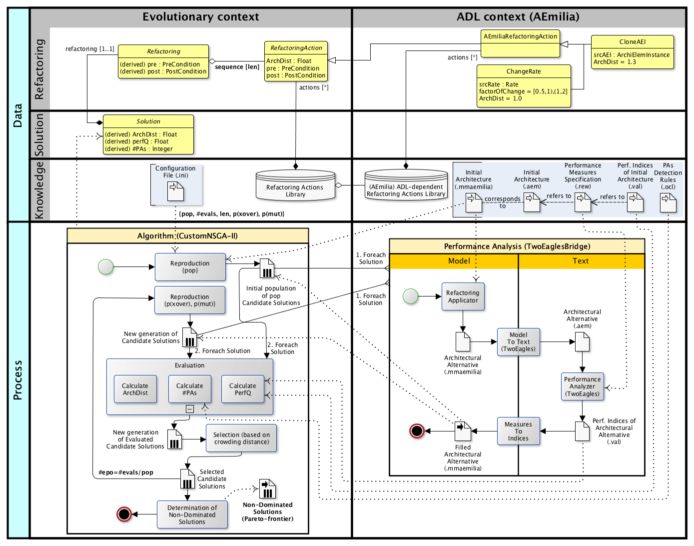

## The EASIER Architecture

The EASIER architecture is illustrated in the following figure.




The figure is vertically divided in two swimlanes. The evolutionary context is on the left, while on the right there is the Architecture Description Language (aka ADL)  context.

### Evolutionary context

The bottom left side of figure illustrates the EASIER core, that is a multi-objective evolutionary algorithm based on the NSGA-II [Deb 2002](https://doi.org/10.1109/4235.996017). 

In particular, we adopted [JMetal](https://github.com/jMetal/jMetal) as a reference library, which is a well established object--oriented Java-based framework for multi-objective optimization with metaheuristics.

#### Data layer

An EASIER Solution represents a a sequence of a number $len$ of architectural RefactoringActions. Both Refactorings and RefactoringActions have PreConditions and PostConditions, which are first-order logical formulae evaluated during the evolutionary process to determine their feasibility.

The adopted mechanism for calculating and verifying Refactorings and RefactoringActions pre(post)conditions is an implementation of the one in [Cinneide 2000](https://doi.org/10.1145/602461.602499).

A Solution also contains a reference to the corresponding alternative architecture. 
Each Solution has three attributes that together represent the objectives of our fitness function, namely $ArchDist$, $PerfQ$ and $\#PAs$.

#### Process

Conformingly to the typical NSGA-II flow, the first iteration of the algorithm consists of a generation phase, aimed at randomly creating an initial population of candidate solutions (i.e. refactorings by $len$ length) with a $pop$ cardinality.

After the generation of the initial population, solutions are evaluated with respect to the fitness function three objectives. In particular,
   - PerfQ (to maximize). It represents a performance quality indicator aimed at quantifying the relative performance improvement induced by a refactoring with respect to an initial architecture. 

   - ArchDist (to minimize). It quantifies the distance of an architectural alternative A from the initial one, in terms of intensity of refactoring changes. The distance of A is defined as the sum of the distance induced by each RefactoringAction a<sub>i</sub> in the corresponding genome. 
        
   - \#PAs (to minimize). It counts the number of performance antipatterns (PAs) occurrences within an alternative architecture. In its current version, EASIER exploits the  OCL engine for antipatterns detection rules specification and verification. 
    
EASIER is the first approach that considers the number of PAs as an objective of an evolutionary algorithm's fitness function.

After the evaluation, non-dominated solutions are ranked according to the notion of crowding distance, and the best ones are selected and used as reproductive basis for the next iterations. 

Finally, each generated architectural alternative undergoes a Performance Analysis process in order to obtain performance indices of interest for the corresponding architectural model. 

### A specific portfolio of Refactoring Actions for AEmilia ADL 

   - CloneAEI is in charge of cloning a srcAEI AEmilia component, given as input, which is randomly selected from the \AEmilia architectural specification. From an architectural point of view, the straightforward semantics for CloneAEI is the deployment of a replica of the original component. 

   - ChangeRate modifies a randomly selected rate of an AEmilia action by multiplying its value by an uniformly distributed FactorOfChange (FOC). ChangeRate intends to represent the option of both enhancing and worsening the performance of a certain action. 


## Related Publications

If you are using EASIER or you have though EASIER is related to your research, please consider to cite it as follows:
   
   * [SEAA 2021]()
```latex
TBA
```
[download the bib from dblp](), [pdf](), [preprint version](https://arxiv.org/abs/2107.06127)
   
   * [INFSOF 2021](https://doi.org/10.1016/j.infsof.2021.106568)
```latex
@article{DBLP:journals/infsof/CortellessaP21,
  author    = {Vittorio Cortellessa and
               Daniele Di Pompeo},
  title     = {Analyzing the sensitivity of multi-objective software architecture
               refactoring to configuration characteristics},
  journal   = {Inf. Softw. Technol.},
  volume    = {135},
  pages     = {106568},
  year      = {2021},
  url       = {https://doi.org/10.1016/j.infsof.2021.106568},
  doi       = {10.1016/j.infsof.2021.106568},
  timestamp = {Sun, 16 May 2021 00:12:15 +0200},
  biburl    = {https://dblp.org/rec/journals/infsof/CortellessaP21.bib},
  bibsource = {dblp computer science bibliography, https://dblp.org}
}
```
[download the bib from dblp](https://dblp.uni-trier.de/rec/journals/infsof/CortellessaP21.bib?param=1), [pdf](https://doi.org/10.1016/j.infsof.2021.106568)

   * [ICSA 2018](http://icsa-conferences.org/2018/)

```latex
@inproceedings{DBLP:conf/icsa/ArcelliCDP18,
  author    = {Davide Arcelli and Vittorio Cortellessa and Mattia D'Emidio and Daniele Di Pompeo},
  title     = {EASIER: An Evolutionary Approach for Multi-objective Software ArchItecturE Refactoring},
  booktitle = {IEEE International Conference on Software Architecture, {ICSA} 2018, Seattle, WA, USA, April 30 - May 4, 2018},
  pages     = {105--114},
  publisher = {IEEE Computer Society},
  year      = {2018},
  url       = {https://doi.org/10.1109/ICSA.2018.00020},
  doi       = {10.1109/ICSA.2018.00020},
  timestamp = {Wed, 16 Oct 2019 14:14:50 +0200},
  biburl    = {https://dblp.org/rec/conf/icsa/ArcelliCDP18.bib},
  bibsource = {dblp computer science bibliography, https://dblp.org}
}

```

[download the bib from dblp](https://dblp.uni-trier.de/rec/bib1/conf/icsa/ArcelliCDP18.bib), [pdf](https://doi.org/10.1109/ICSA.2018.00020), or the [preprint version](http://danieledipompeo.github.io/files/papers/2018-icsa-easier.pdf)  

   * [IWoR 2018](https://iwor.github.io/iwor2018/)

```latex
@inproceedings{DBLP:conf/kbse/ArcelliCP18,
  author    = {Davide Arcelli and
               Vittorio Cortellessa and
               Daniele Di Pompeo},
  editor    = {Ali Ouni and Marouane Kessentini and  Mel {\'{O}} Cinn{\'{e}}ide},
  title     = {A metamodel for the specification and verification of model refactoring actions},
  booktitle = {Proceedings of the 2nd International Workshop on Refactoring, IWoR@ASE 2018, Montpellier, France, September 4, 2018},
  pages     = {14--21},
  publisher = {IWoR@ACM},
  year      = {2018},
  url       = {https://doi.org/10.1145/3242163.3242167},
  doi       = {10.1145/3242163.3242167},
  timestamp = {Wed, 21 Nov 2018 12:44:20 +0100},
  biburl    = {https://dblp.org/rec/conf/kbse/ArcelliCP18.bib},
  bibsource = {dblp computer science bibliography, https://dblp.org}
}
```
[download the bib from dblp](https://dblp.org/rec/conf/kbse/ArcelliCP18.bib), [pdf](https://doi.org/10.1145/3242163.3242167).
